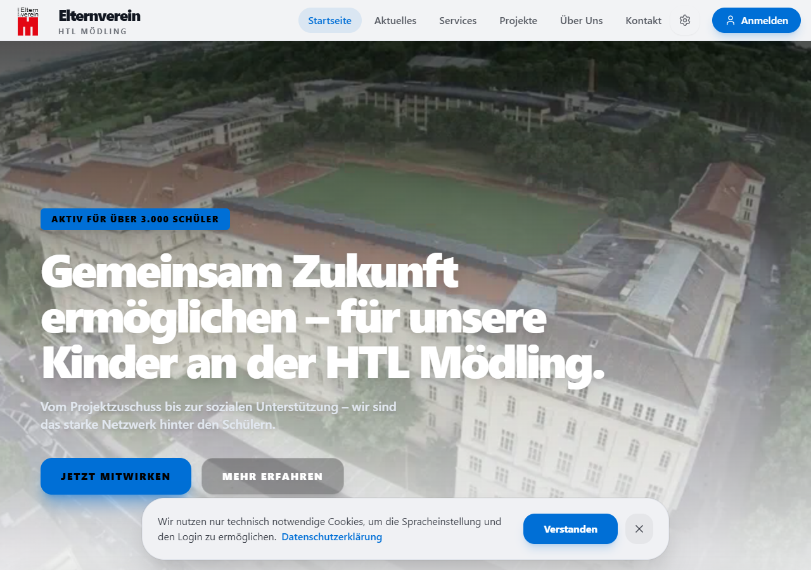
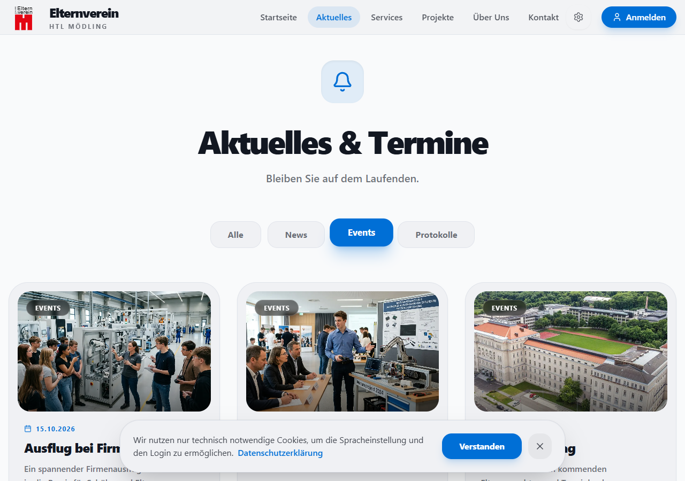
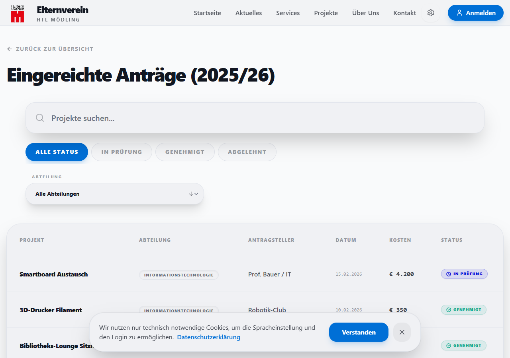

# Projekt-Zusammenfassung: Elternverein HTL Mödling

Diese Website dient als zentrale Plattform für den Elternverein der HTL Mödling. Sie bietet Informationen, Projektverwaltung und News für Eltern, Schüler und Lehrer.

## Technische Highlights

### 🌍 Internationalisierung (i18next)
- **Vollständige Mehrsprachigkeit**: Die gesamte Seite ist auf Deutsch und Englisch verfügbar.
- **Dynamic Translation**: Einfache Erweiterbarkeit durch strukturierte JSON-Dateien (`de.json`, `en.json`).
- **Spracherkennung**: Merkt sich die bevorzugte Sprache des Nutzers.

### 🎨 Design System (Tailwind CSS 4.0 & Flat Design)
- **Modernes Interface**: Einsatz von Tailwind CSS für ein responsives, performantes und ästhetisch ansprechendes Design.
- **Flat Design**: Konsequente Nutzung von klaren, kontrastreichen Farben für News-Kategorien und UI-Elemente.
- **Dark Mode**: Vollständige Unterstützung für ein angenehmes Seherlebnis bei wenig Licht.

### ⚡ Live-Theming (Beta)
- **Dynamische Anpassung**: Primärfarbe und Ecken-Radius können live im Browser getestet werden.
- **CSS-Variablen**: Echtzeit-Updates über `--primary` und `--radius` Steuerung auf dem `:root`-Element.
- **Theme-Konfiguration**: Globale Standardwerte werden über die `theme-config.json` gesteuert.

### 📂 Dynamisches Filtern & Suche
- **Projektübersicht**: Client-seitiges Filtern nach Abteilung (z.B. Bautechnik, Elektrotechnik) und Status (Offen, Abgeschlossen).
- **News-Feed**: Kategorisierung und Filterung von Nachrichten (Event, Protokoll, News).

### 🔐 Authentifizierung & Sicherheit
- **Supabase Integration**: Vorbereitet für sichere Benutzerverwaltung und Datenbank-Anbindung.
- **Dev-Bypass**: Entwickler-Modus für schnelles Testen ohne Login-Barriere während der Entwicklung.

## Feature-Übersicht
| Feature | Status | Beschreibung |
| :--- | :--- | :--- |
| News-Filter | ✅ Aktiv | Filtern von Nachrichten nach Kategorien. |
| Projekt-Antrag | ✅ Aktiv | Formular zur Einreichung von Förderanträgen. |
| Design-Vorschau | ✅ Aktiv | Live-Anpassung von Farbe und Radius im Footer. |
| Language Switcher | ✅ Aktiv | Nahtloser Wechsel zwischen DE/EN. |
| Dashboard | ✅ Aktiv | Interne Übersicht für Vorstandsmitglieder. |

---
*Erstellt von Antigravity für den Elternverein HTL Mödling.*
