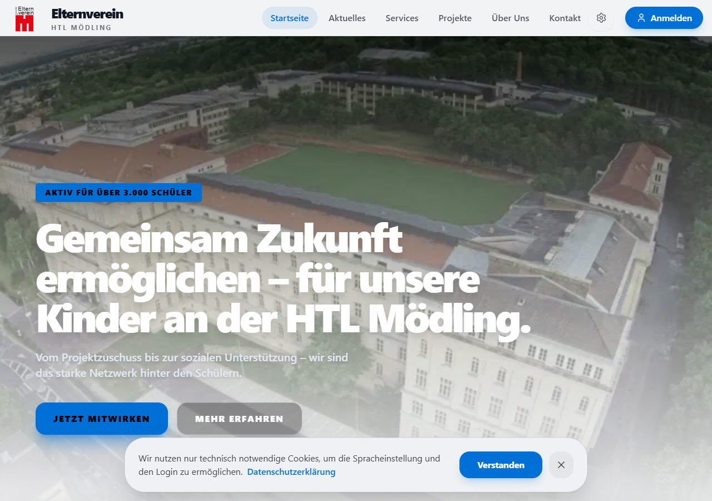
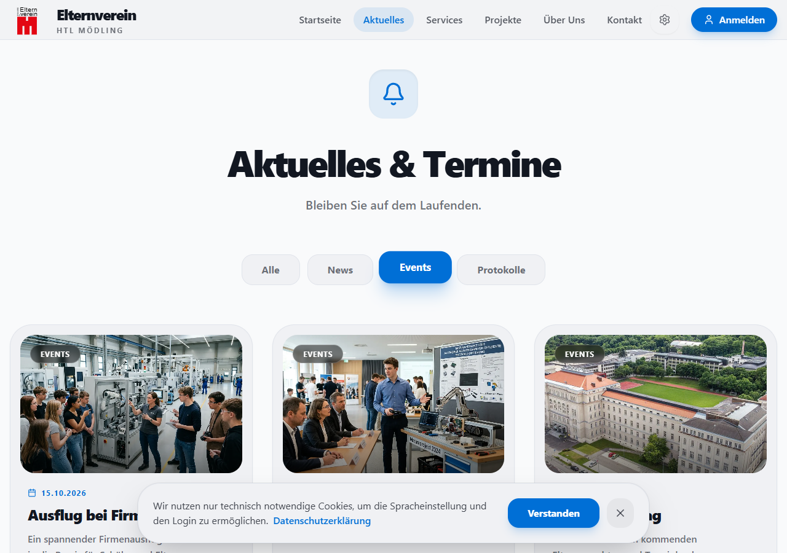
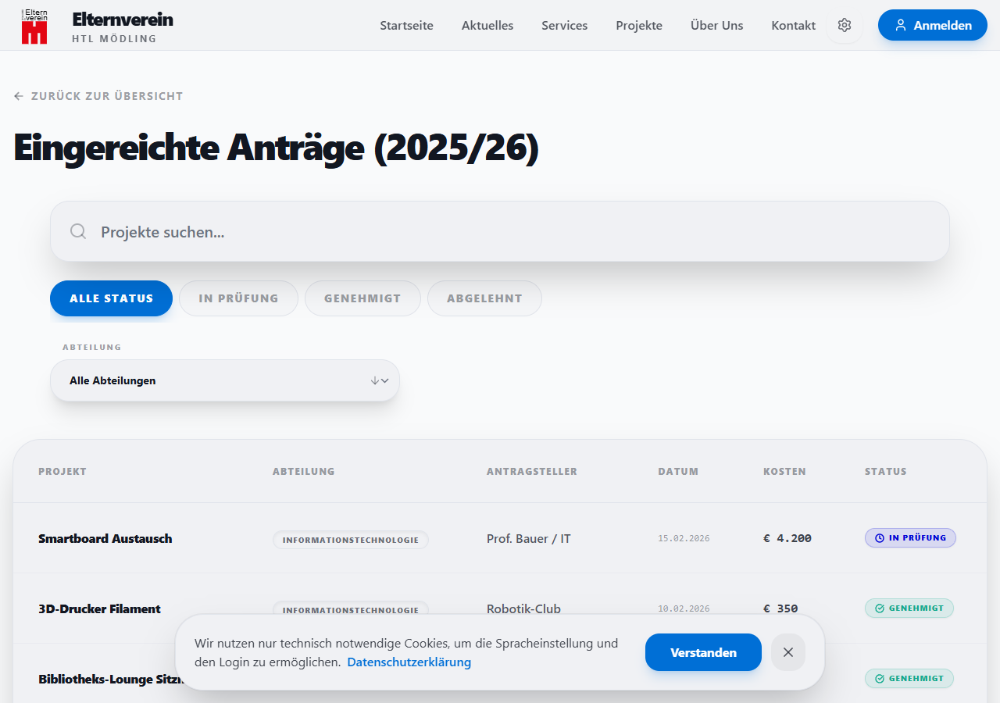

# Projekt-Zusammenfassung: Elternverein HTL Mödling

Diese Website dient als zentrale Plattform für den Elternverein der HTL Mödling. Sie bietet Informationen, Projektverwaltung und News für Eltern, Schüler und Lehrer.

## Tech-Stack

| Technologie | Version | Zweck |
| :--- | :--- | :--- |
| React | ^19.2.0 | UI-Framework |
| React Router | ^7.13.0 | Client-seitiges Routing (SPA) |
| Vite | ^7.3.1 | Build-Tool & Dev-Server |
| TypeScript | ~5.9.3 | Typsicheres JavaScript |
| Tailwind CSS | ^3.4.1 | Utility-first CSS-Framework |
| i18next | ^25.8.4 | Internationalisierung |
| react-i18next | ^16.5.4 | React-Bindings für i18next |
| Lucide React | ^0.563.0 | Icon-Bibliothek |
| react-helmet-async | ^2.0.5 | SEO / Meta-Tags |
| Vercel Analytics | ^1.6.1 | Website-Analysen |
| Vercel Speed Insights | ^1.3.1 | Performance-Monitoring |
| clsx / tailwind-merge | ^2.1.1 / ^3.4.0 | Bedingte Klassen-Komposition |

## Technische Highlights

### 🌍 Internationalisierung (i18next) — 10 Sprachen

- **Vollständige Mehrsprachigkeit**: Die gesamte Seite ist in **10 Sprachen** verfügbar:
  Deutsch (🇦🇹), Englisch (🇬🇧), Türkisch (🇹🇷), Ukrainisch (🇺🇦), Spanisch (🇪🇸), Italienisch (🇮🇹), Französisch (🇫🇷), Polnisch (🇵🇱), Portugiesisch (🇵🇹) und Arabisch (🇦🇪).
- **RTL-Unterstützung**: Arabisch wird mit automatischer `dir="rtl"`-Umschaltung unterstützt; CSS nutzt logische Properties (`start`/`end`).
- **Dynamic Translation**: Einfache Erweiterbarkeit durch strukturierte JSON-Dateien im Ordner `src/locales/`.
- **Spracherkennung**: Merkt sich die bevorzugte Sprache des Nutzers über `i18next-browser-languagedetector`.
- **Fallback**: Englisch (`en`) als Fallback-Sprache konfiguriert.

### 🎨 Design System (Tailwind CSS 3.4 & Flat Design)

- **Modernes Interface**: Einsatz von Tailwind CSS mit `@tailwindcss/forms` und `@tailwindcss/typography` Plugins für ein responsives, performantes und ästhetisch ansprechendes Design.
- **HSL-basiertes Farbsystem**: Alle Farben werden über CSS-Variablen (`--primary`, `--background`, `--surface`, etc.) in HSL definiert. Statusfarben (success, warning, destructive, info) werden automatisch mit 15% Primärfarbe gemischt.
- **Dark Mode**: Vollständige Unterstützung über `class`-basiertes Toggling mit persistiertem User-Preference in `localStorage`.
- **Animationen**: Custom Keyframes (`gradient-x`, `fade-up`) für Micro-Animationen.

### ⚡ Live-Theming (Beta)

- **Dynamische Anpassung**: Primärfarbe und Ecken-Radius können live im Browser getestet werden.
- **CSS-Variablen**: Echtzeit-Updates über `--primary` und `--radius` Steuerung auf dem `:root`-Element.
- **Theme-Konfiguration**: Globale Standardwerte werden über die `theme-config.json` gesteuert (aktuell: `primary: #2563eb`, `borderRadius: 0.75rem`).



### 🔍 SEO & Structured Data

- **React Helmet Async**: Jede Seite setzt individuelle `<title>`, `<meta description>`, Open Graph- und Twitter Card-Tags.
- **JSON-LD Schema**: Automatisch generiertes `Organization`- bzw. `NewsArticle`-Schema für strukturierte Daten.
- **Canonical URLs** und **Keywords** pro Seite konfigurierbar.

### 📂 Dynamisches Filtern & Suche

- **Projektübersicht**: Client-seitiges Filtern nach Abteilung (IT, Maschinenbau, Elektrotechnik, Bautechnik, Elektronik, Chemie, Sport, Finanzen) und Status (Genehmigt, In Prüfung, Abgelehnt).
- **News-Feed**: Kategorisierung und Filterung von Nachrichten (Event, Protokoll, News).




### 🍪 Cookie-Banner & Datenschutz

- **DSGVO-konformer Cookie-Banner**: Nur technisch notwendige Cookies, mit Link zur Datenschutzerklärung.
- **Consent-Persistierung**: Cookie-Consent wird in `localStorage` gespeichert.

### 🔐 Authentifizierung

- **Login-Modal**: Vorbereitet für Benutzerverwaltung (aktuell Dev-Bypass mit Simulation).
- **Dashboard**: Interner Bereich für Vorstandsmitglieder mit Kalenderansicht.
- **Hinweis**: Supabase ist aktuell **nicht aktiv integriert** – keine Supabase-Importe im Quellcode vorhanden. Das Login funktioniert derzeit als Client-only Simulation.

### ⚙️ Einstellungen (Settings-Modal)

- **Sprachauswahl**: Dropdown mit allen 10 Sprachen (inkl. Flaggen-Emojis).
- **Theme-Umschaltung**: Light/Dark Mode Toggle mit persistierter Einstellung.
- **Escape- und Backdrop-Close**: Barrierefreies Modal-Verhalten.

## Routen-Übersicht

### Öffentliche Seiten (`<Layout>`)

| Route | Seite | Beschreibung |
| :--- | :--- | :--- |
| `/` | Home | Startseite mit Hero, Benefits, Social Proof, News, FAQ |
| `/news` | News | Aktuelles & Termine mit Kategoriefilter |
| `/about` | Über Uns | Informationen über den Elternverein |
| `/about/board` | Vorstand | Vorstandsmitglieder und Rollen |
| `/about/statutes` | Statuten | Rechtliche Grundlage des Vereins |
| `/kontakt` | Kontakt | Kontaktformular und Anfahrt |
| `/services` | Services | Soziale Unterstützung, Nachhilfe, Kurse |
| `/services/:type` | Services (Detail) | Dynamischer Service-Filter |
| `/projekte` | Projekte | Aktuelle Projekte und Initiativen |
| `/projekte/archiv` | Projektarchiv | Historie vergangener Schuljahre |
| `/projekte/uebersicht` | Projektübersicht | Tabelle aller eingereichten Anträge |
| `/projekte/antrag` | Projektantrag | Formular zur Einreichung von Förderanträgen |
| `/terms` | Geschäftsordnung | Regeln und Bestimmungen |
| `/datenschutz` | Datenschutz | Datenschutzerklärung |
| `/impressum` | Impressum | Rechtliche Informationen |
| `/login` | Login | Anmeldung zum internen Bereich |

### Interner Bereich (`<InternalLayout>`)

| Route | Seite | Status |
| :--- | :--- | :--- |
| `/dashboard` | Dashboard | ✅ Implementiert |
| `/dashboard/calendar` | Kalender | ✅ Implementiert (Mock-Daten) |
| `/dashboard/messages` | Nachrichten | 🚧 Platzhalter ("Coming soon") |
| `/dashboard/settings` | Einstellungen | 🚧 Platzhalter ("Coming soon") |

## Feature-Übersicht

| Feature | Status | Beschreibung |
| :--- | :--- | :--- |
| News-Filter | ✅ Aktiv | Filtern von Nachrichten nach Kategorien. |
| Projekt-Antrag | ✅ Aktiv | Formular zur Einreichung von Förderanträgen. |
| Projekt-Übersicht | ✅ Aktiv | Tabellarische Ansicht mit Such-/Abteilungs-/Statusfilter. |
| Projekt-Archiv | ✅ Aktiv | Historie vergangener Schuljahre. |
| Design-Vorschau | ✅ Aktiv | Live-Anpassung von Farbe und Radius via `theme-config.json`. |
| Language Switcher | ✅ Aktiv | 10 Sprachen inkl. RTL (Arabisch). |
| Dashboard | ✅ Aktiv | Interne Übersicht für Vorstandsmitglieder. |
| Kalender | ✅ Aktiv | Shared Calendar im Dashboard (Mock-Daten). |
| SEO / Structured Data | ✅ Aktiv | JSON-LD, Open Graph, Twitter Cards auf allen Seiten. |
| Cookie-Banner | ✅ Aktiv | DSGVO-konforme Cookie-Einwilligung. |
| Dark Mode | ✅ Aktiv | Vollständige Light/Dark Mode Unterstützung. |
| Settings-Modal | ✅ Aktiv | Sprache & Theme aus einem zentralen Modal. |
| Vercel Analytics | ✅ Aktiv | Website-Traffic und Speed Insights. |
| Services-Seite | ✅ Aktiv | Soziale Unterstützung, Nachhilfe, Kurse. |
| Vorstand-Seite | ✅ Aktiv | Übersicht der Vorstandsmitglieder & Rollen. |
| Statuten & Geschäftsordnung | ✅ Aktiv | Rechtliche Vereinsdokumente. |
| FAQ-Sektion | ✅ Aktiv | Interaktives Accordion auf der Startseite. |
| Supabase Backend | ⏸️ Vorbereitet | Kein aktiver Code – Login ist Dev-Bypass. |
| Dashboard Messages | 🚧 Geplant | Platzhalter im internen Bereich. |
| Dashboard Settings | 🚧 Geplant | Platzhalter im internen Bereich. |

## Deployment

- **Hosting**: Vercel
- **SPA-Routing**: `vercel.json` konfiguriert Catch-All Rewrite auf `/index.html`.
- **Build**: `tsc -b && vite build` (TypeScript-Check + Vite-Produktionsbuild).
- **Analytics**: Vercel Analytics + Speed Insights automatisch integriert.

## 🚀 Performance Audit & Optimierung

Basierend auf den PageSpeed-Berichten vom 24.02.2026 wurden folgende Engpässe identifiziert:

### Aktuelle Werte (Stand: 24.02.2026)

- **Mobile Score**: 74 / 100 (LCP: 22.1s)
- **Desktop Score**: 79 / 100 (LCP: 3.7s)

> ⚠️ **Hinweis**: Es liegen keine neueren Messwerte vor. Die Werte könnten sich durch zwischenzeitliche Änderungen geändert haben. Ein neuer PageSpeed-Test wird empfohlen.

### ⚠️ Performance-Bottlenecks

1. **Riesige Hero-Bild**: Die Datei `hero-bg.webp` ist mit **3.85 MB** viel zu groß für das Web. Dies verursacht den extrem hohen LCP (Largest Contentful Paint).
2. **Render-blocking Ressourcen**: CSS und JS blockieren den ersten Seitenaufbau.
3. **Unused JavaScript**: Es wird Code geladen, der auf der Initialseite nicht benötigt wird.
4. **Kein Code-Splitting**: Alle Routen werden synchron importiert (`React.lazy()` wird nicht verwendet).

### 🛠️ Konkrete Optimierungsschritte

- [ ] **Bildkompression**: `hero-bg.webp` auf unter 500KB komprimieren (z.B. mit [Squoosh](https://squoosh.app/)). Aktuell **3.85 MB**.
- [ ] **Next-Gen Formate**: Konsequente Nutzung von `.avif` für noch bessere Kompression als WebP. (Teilweise umgesetzt: `htl-gebaeude-von-oben.avif` existiert bereits.)
- [ ] **Lazy Loading**: Bilder unterhalb des "Above-the-fold" Bereichs mit `loading="lazy"` markieren. (Noch **nicht** implementiert.)
- [ ] **Code Splitting**: Nutzen von `React.lazy()` für Routen, um das Initialpaket zu verkleinern. (Noch **nicht** implementiert.)
- [ ] **Vercel Edge Caching**: Konfiguration von Cache-Control Headern für statische Assets.

## Projektstruktur

```
Elternverein/
├── public/
│   └── elternverein/         # Statische Bilder (Hero, Teamfotos, Logo)
├── src/
│   ├── components/           # 13 Komponenten (Layout, Navbar, Footer, SEO, ...)
│   ├── locales/              # 10 Sprach-Dateien (de, en, tr, ua, es, it, fr, pl, ar, pt)
│   ├── pages/                # 17 Seiten-Komponenten
│   ├── i18n.ts               # i18next Konfiguration
│   ├── App.tsx               # Router & App-Struktur
│   └── main.tsx              # Einstiegspunkt (Analytics, SpeedInsights)
├── docs/screenshots/         # Design-Screenshots für README
├── theme-config.json         # Live-Theming Konfiguration
├── tailwind.config.js        # Erweitertes Design-System (HSL, Animations)
├── vercel.json               # SPA-Rewrite für Vercel
├── vite.config.ts            # Vite Build-Konfiguration
└── package.json              # Abhängigkeiten & Scripts
```

## Changelog

### 2026-03-30 — README auf aktuellen Stand gebracht

- **Tech-Stack-Tabelle** hinzugefügt mit allen Abhängigkeiten und exakten Versionen aus `package.json`.
- **Sprachen**: Von "DE/EN" auf **10 Sprachen** aktualisiert (TR, UA, ES, IT, FR, PL, PT, AR neu hinzugefügt seit Erstversion).
- **RTL-Unterstützung** für Arabisch dokumentiert.
- **Tailwind CSS Version** korrigiert: `3.4.1` statt `4.0` (wie im Original fälschlicherweise angegeben).
- **Routen-Übersicht** komplett neu erstellt – 16 öffentliche + 4 interne Routen dokumentiert.
- **Feature-Tabelle** erweitert: 12 neue Features ergänzt (Projekt-Archiv, -Übersicht, SEO, Cookie-Banner, Dark Mode, Settings-Modal, FAQ, Services, Vorstand, Statuten, Analytics, Kalender).
- **Supabase-Status** korrigiert: Von "Integration vorbereitet" auf "⏸️ Vorbereitet – kein aktiver Code".
- **Dashboard-Platzhalter** (Messages, Settings) als 🚧 Geplant markiert.
- **SEO-Abschnitt** neu hinzugefügt (JSON-LD, Open Graph, Helmet).
- **Cookie-Banner** und **Settings-Modal** als eigenständige Feature-Abschnitte dokumentiert.
- **Projektstruktur** als Baum-Übersicht hinzugefügt.
- **Performance-Audit**: Status der Optimierungen aktualisiert (weiterhin alle offen, mit Details zu fehlendem `React.lazy()` und `loading="lazy"`).

### Vor 2026-03-30

- Initiale Erstellung der Website mit React 19, Vite, Tailwind CSS.
- Implementierung von i18next mit DE/EN, later erweitert auf 10 Sprachen.
- Dashboard mit Kalender-Ansicht.
- Vercel Deployment mit Analytics und Speed Insights.
- SEO-Komponente mit JSON-LD Structured Data.

---
*Erstellt und gepflegt mit Unterstützung von Antigravity für den Elternverein HTL Mödling.*
