# Teams-Aufgabe – Elternverein HTL Mödling Website-Redesign

> **Projekt:** Website-Redesign Elternverein HTL Mödling  
> **Fach:** MEDT (2. Semester)  
> **Datum:** 18. April 2026  

---

## Aufgabe 1 – Vorschlag Menüstruktur (Sitemap)

### 1.1 Überblick

Die vorgeschlagene Menüstruktur orientiert sich an den **fünf Kernaufgaben** des Elternvereins (Fördern, Unterstützen, Helfen, Informieren, Unterhalten) und priorisiert eine klare Informationshierarchie für die drei Zielgruppen: **Eltern, Schüler und Lehrer**.

### 1.2 Hauptseiten & Unterseiten

| # | Hauptmenüpunkt | Unterseiten | Beschreibung |
|---|----------------|-------------|--------------|
| 1 | **Startseite** | – | Hero-Bereich, aktuelle News-Teaser, Quick-Links zu Förderungen, Veranstaltungskalender-Widget |
| 2 | **Aktuelles** | Neuigkeiten · Termine & Kalender | Aktuelle Beiträge, Pressemeldungen, Veranstaltungskalender mit Export-Funktion (.ics) |
| 3 | **Angebote** | Nachhilfe · Soziale Unterstützung · Kurse & Zusatzqualifikationen | Übersicht der Serviceleistungen des EV (Kernaufgabe „Helfen" & „Informieren") |
| 4 | **Projekte** | Aktuelle Projekte · Projektantrag stellen · Projektarchiv | Förderanträge aus Elternbeiträgen, Übersicht laufender & abgeschlossener Projekte (Kernaufgabe „Fördern") |
| 5 | **Über uns** | Der Verein · Vorstand · Satzungen | Vereinsgeschichte, Vorstandsmitglieder, Vereinsstatuten (Kernaufgabe „Unterstützen") |
| 6 | **Kontakt** | Kontaktformular · Anfahrt | Kontaktdaten, eingebettete Karte, Formulareinsendung |

**Zusätzliche Seiten (Footer / rechtlich):**

| Seite | Zweck |
|-------|-------|
| Impressum | Pflichtangaben nach § 5 ECG |
| Datenschutz | DSGVO-konforme Datenschutzerklärung |
| Nutzungsbedingungen | Allgemeine Bedingungen |

**Interner Bereich (nach Login):**

| Seite | Zweck |
|-------|-------|
| Dashboard | Aktivitäts-Tracking, Kalender-Management, News verfassen |
| Einstellungen | Sprach- & Theme-Einstellungen, Kontoeinstellungen |
| Nachrichten | Interner Nachrichtenverlauf des Vorstands |

### 1.3 Sitemap als Baumdiagramm

```mermaid
graph TD
    ROOT["🏠 Elternverein HTL Mödling"]

    ROOT --> HOME["Startseite"]
    ROOT --> NEWS["Aktuelles"]
    ROOT --> SERVICES["Angebote"]
    ROOT --> PROJECTS["Projekte"]
    ROOT --> ABOUT["Über uns"]
    ROOT --> CONTACT["Kontakt"]

    NEWS --> NEWS1["Neuigkeiten"]
    NEWS --> NEWS2["Termine & Kalender"]

    SERVICES --> SVC1["Nachhilfe"]
    SERVICES --> SVC2["Soziale Unterstützung"]
    SERVICES --> SVC3["Kurse & Zusatzqualifikationen"]

    PROJECTS --> PRJ1["Aktuelle Projekte"]
    PROJECTS --> PRJ2["Projektantrag stellen"]
    PROJECTS --> PRJ3["Projektarchiv"]

    ABOUT --> ABT1["Der Verein"]
    ABOUT --> ABT2["Vorstand"]
    ABOUT --> ABT3["Satzungen"]

    CONTACT --> CNT1["Kontaktformular"]
    CONTACT --> CNT2["Anfahrt"]

    ROOT --> LOGIN["🔐 Login"]
    LOGIN --> DASH["Dashboard"]
    LOGIN --> SETTINGS["Einstellungen"]
    LOGIN --> MSG["Nachrichten"]

    ROOT --> FOOTER["📄 Footer-Seiten"]
    FOOTER --> IMP["Impressum"]
    FOOTER --> DSG["Datenschutz"]
    FOOTER --> AGB["Nutzungsbedingungen"]

    style ROOT fill:#1e40af,stroke:#1e3a8a,color:#ffffff,font-weight:bold
    style HOME fill:#3b82f6,stroke:#2563eb,color:#ffffff
    style NEWS fill:#3b82f6,stroke:#2563eb,color:#ffffff
    style SERVICES fill:#3b82f6,stroke:#2563eb,color:#ffffff
    style PROJECTS fill:#3b82f6,stroke:#2563eb,color:#ffffff
    style ABOUT fill:#3b82f6,stroke:#2563eb,color:#ffffff
    style CONTACT fill:#3b82f6,stroke:#2563eb,color:#ffffff
    style LOGIN fill:#f59e0b,stroke:#d97706,color:#1e293b,font-weight:bold
    style FOOTER fill:#64748b,stroke:#475569,color:#ffffff
```

### 1.4 Begründung der Struktur

| Designentscheidung | Begründung |
|--------------------|------------|
| **Max. 6 Hauptpunkte** | Kognitive Last minimieren – die „7 ± 2"-Regel für Menüpunkte einhalten |
| **„Angebote" statt einzelne Services** | Bündelung der Hilfsangebote unter einem Dach für schnellen Zugang |
| **Projektantrag als eigene Unterseite** | Aktive Handlungsaufforderung (CTA) – Kern des Förderzwecks |
| **Interner Bereich hinter Login** | Vorstands-Funktionen klar vom öffentlichen Bereich trennen |
| **Footer für rechtliche Seiten** | Branchenstandard, kein Platz in der Hauptnavigation nötig |

---

## Aufgabe 2 – Briefing-Fragebogen für den Elternverein

> Professioneller Fragebogen der „Agentur" an den Kunden (Elternverein HTL Mödling) zur Vorbereitung des Website-Redesigns.

---

### 📋 Briefing-Fragebogen: Website-Redesign Elternverein HTL Mödling

**An:** Vorstand des Elternvereins HTL Mödling  
**Von:** Web-Agentur [Team-Name], HTL Mödling – MEDT  
**Datum:** _______________  

Sehr geehrte Damen und Herren,

vielen Dank für Ihr Vertrauen in unsere Agentur! Um die neue Website optimal auf Ihre Bedürfnisse zuzuschneiden, bitten wir Sie, den folgenden Fragebogen möglichst vollständig auszufüllen. Ihre Antworten bilden die Grundlage für unser Konzept und Design.

---

#### Kategorie 1: Allgemeine Informationen

| Nr. | Frage |
|-----|-------|
| 1.1 | Wie lautet der vollständige, offizielle Name des Vereins? |
| 1.2 | Gibt es ein bestehendes Logo? Wenn ja, bitte als Vektordatei (SVG/EPS) bereitstellen. |
| 1.3 | Existiert ein Corporate-Design-Leitfaden (Farben, Schriftarten, Bildsprache)? |
| 1.4 | Wer ist die primäre Ansprechperson für Rückfragen während des Projekts? (Name, E-Mail, Telefon) |
| 1.5 | Gibt es Fristen oder Termine, zu denen die Website online sein muss? |

#### Kategorie 2: Zielgruppe & Ziele

| Nr. | Frage |
|-----|-------|
| 2.1 | Wer sind die **primären Zielgruppen** der Website? (z. B. Eltern, Schüler, Lehrer, potenzielle Mitglieder) |
| 2.2 | Was ist das **wichtigste Ziel** der neuen Website? (z. B. Mitgliedergewinnung, Information, Projektanträge) |
| 2.3 | Welche **Handlungen** sollen Besucher auf der Website durchführen? (z. B. Beitritt, Kontaktaufnahme, Spende) |
| 2.4 | Gibt es Websites von anderen Elternvereinen oder Organisationen, die Ihnen besonders gut gefallen? Wenn ja, welche und warum? |
| 2.5 | Was hat an der **bisherigen Website** gut funktioniert, was nicht? |

#### Kategorie 3: Inhalte & Medien

| Nr. | Frage |
|-----|-------|
| 3.1 | Welche **Texte** liegen bereits vor? (z. B. Vereinsbeschreibung, Vorstandsvorstellung, Satzung) |
| 3.2 | Stehen **Fotos** zur Verfügung? (z. B. Schulgebäude, Veranstaltungen, Vorstandsfotos) Bitte in möglichst hoher Auflösung. |
| 3.3 | Gibt es **Videomaterial**, das auf der Website eingebunden werden soll? |
| 3.4 | Soll ein **Blog- oder Nachrichtenbereich** gepflegt werden? Wenn ja, wie häufig werden neue Beiträge erwartet? |
| 3.5 | Welche **historischen Daten** (vergangene Projekte, Veranstaltungen, Berichte) sollen auf die neue Website migriert werden? |
| 3.6 | In welchen **Sprachen** soll die Website verfügbar sein? |

#### Kategorie 4: Funktionale Anforderungen

| Nr. | Frage |
|-----|-------|
| 4.1 | Soll ein **Kontaktformular** integriert werden? An welche E-Mail-Adresse(n) sollen Anfragen geleitet werden? |
| 4.2 | Wird ein **Veranstaltungskalender** benötigt? Falls ja, wer pflegt die Einträge? |
| 4.3 | Soll es einen **internen Bereich** (Login) geben, z. B. für den Vorstand? Welche Funktionen soll dieser bieten? |
| 4.4 | Sollen **Online-Formulare** bereitgestellt werden? (z. B. Förderanträge, Beitrittsformulare) |
| 4.5 | Ist eine **Newsletter-Funktion** gewünscht? |
| 4.6 | Werden **Social-Media-Kanäle** betrieben, die verlinkt werden sollen? (Facebook, Instagram, etc.) |
| 4.7 | Soll die Website **barrierefrei** (WCAG-konform) gestaltet werden? |

#### Kategorie 5: Technik & Betrieb

| Nr. | Frage |
|-----|-------|
| 5.1 | Gibt es einen bestehenden **Hosting-Vertrag** oder eine bevorzugte Hosting-Lösung? |
| 5.2 | Ist eine bestimmte **Domain** bereits registriert? (z. B. elternverein-htl-moedling.at) |
| 5.3 | Wer soll die Website nach dem Launch **pflegen und aktualisieren**? Wie hoch ist das technische Niveau dieser Person(en)? |
| 5.4 | Wird ein **Content-Management-System** (CMS) benötigt, mit dem Inhalte ohne Programmierkenntnisse bearbeitet werden können? |
| 5.5 | Gibt es **Datenschutzanforderungen**, die berücksichtigt werden müssen? (DSGVO, Cookie-Consent) |

#### Kategorie 6: Design & Gestaltung

| Nr. | Frage |
|-----|-------|
| 6.1 | Welche **Stimmung / Atmosphäre** soll die Website vermitteln? (z. B. professionell, familiär, modern, traditionell) |
| 6.2 | Gibt es **Farben**, die zwingend verwendet werden sollen? (z. B. Vereinsfarben, Schulfarben der HTL Mödling) |
| 6.3 | Gibt es **Designelemente**, die Sie sich wünschen? (z. B. große Bilder, Animationen, Slider) |
| 6.4 | Gibt es Websites, deren **Design Ihnen NICHT gefällt**? Was stört Sie daran? |

#### Kategorie 7: Budget & Zeitrahmen

| Nr. | Frage |
|-----|-------|
| 7.1 | Steht ein **Budget** für die Website zur Verfügung? (z. B. für Hosting, Premium-Themes, Plugins) |
| 7.2 | Bis wann soll die Website **fertiggestellt** sein? Gibt es Meilensteine? |
| 7.3 | Wird nach dem Launch ein **Wartungsvertrag** oder laufende Betreuung gewünscht? |

---

*Bitte senden Sie den ausgefüllten Fragebogen an [E-Mail] zurück. Bei Rückfragen stehen wir Ihnen jederzeit zur Verfügung!*

*Mit freundlichen Grüßen,*  
*Ihr Web-Agentur-Team*

---

## Aufgabe 3 – Vorschlag potenzieller WordPress-Vorlagen

### 3.1 Bewertungskriterien

Jede Vorlage wurde nach den drei vorgegebenen Kriterien bewertet:

| Kriterium | Beschreibung | Gewichtung |
|-----------|--------------|------------|
| 🛠️ **Einfach zu managen** | Bearbeitbar ohne Code-Kenntnisse, intuitive Oberfläche, gute Dokumentation | 40 % |
| 💰 **Kostengünstig** | Geringe oder keine laufende Kosten (keine Zwangslizenz für Kernfunktionen) | 30 % |
| 🎨 **Ansprechend & anpassbar** | Modernes Design, flexible Anpassung an Vereins-Branding, responsive | 30 % |

### 3.2 Vorlagen-Vergleich

#### 🥇 Empfehlung 1: Astra (+ Starter Templates)

| Eigenschaft | Details |
|-------------|---------|
| **Typ** | Freemium (kostenlose Basisversion, Pro ab ~47 €/Jahr) |
| **Page Builder** | Kompatibel mit Gutenberg, Elementor, Beaver Builder |
| **Starter Templates** | 240+ vorgefertigte Websites (1-Klick-Import), inkl. Non-Profit-Vorlagen |
| **Performance** | < 50 KB Frontend-Footprint, schnellstes Theme im Vergleich |
| **Dokumentation** | Umfangreiche Video-Tutorials und Knowledge Base |

| Kriterium | Bewertung | Begründung |
|-----------|-----------|------------|
| 🛠️ Management | ⭐⭐⭐⭐⭐ | 1-Klick Demo-Import, Drag-and-Drop mit Elementor, keine Code-Kenntnisse nötig |
| 💰 Kosten | ⭐⭐⭐⭐ | Kostenlose Version für Grundfunktionen ausreichend; Pro optional |
| 🎨 Design | ⭐⭐⭐⭐⭐ | Große Auswahl an modernen Starter-Designs, volle Farb- und Typo-Anpassung |

**Gesamtbewertung: 9.3/10** – Beste Allround-Lösung für schnellen Start und langfristigen Betrieb.

---

#### 🥈 Empfehlung 2: GeneratePress

| Eigenschaft | Details |
|-------------|---------|
| **Typ** | Freemium (Pro ab ~49 €/Jahr) |
| **Page Builder** | Gutenberg-optimiert, kompatibel mit allen großen Buildern |
| **Philosophie** | Minimal, performance-orientiert, sauberer Code |
| **Performance** | < 30 KB Frontend-Footprint, schnellstes Rendering |
| **Dokumentation** | Gute offizielle Docs, aktive Community |

| Kriterium | Bewertung | Begründung |
|-----------|-----------|------------|
| 🛠️ Management | ⭐⭐⭐⭐ | Etwas steilere Lernkurve als Astra, aber sehr stabil und vorhersehbar |
| 💰 Kosten | ⭐⭐⭐⭐ | Günstig; Pro-Lizenz ist einmalig (Lifetime-Option vorhanden) |
| 🎨 Design | ⭐⭐⭐⭐ | Sauberes Minimalist-Design; weniger Starter-Templates als Astra |

**Gesamtbewertung: 8.0/10** – Ideal für Teams mit etwas technischem Hintergrund, die Wert auf Langlebigkeit und Performance legen.

---

#### 🥉 Empfehlung 3: Hello Elementor

| Eigenschaft | Details |
|-------------|---------|
| **Typ** | Kostenlos (erfordert Elementor Plugin, Free oder Pro ab ~49 €/Jahr) |
| **Page Builder** | Exklusiv für Elementor – visueller Drag-and-Drop-Builder |
| **Starter Templates** | 100+ vorgefertigte Kits (viele nur in Elementor Pro) |
| **Performance** | Mittel – Elementor fügt zusätzliches CSS/JS hinzu |
| **Dokumentation** | Hervorragend (Video-Akademie, Community) |

| Kriterium | Bewertung | Begründung |
|-----------|-----------|------------|
| 🛠️ Management | ⭐⭐⭐⭐⭐ | Intuitivster visueller Builder auf dem Markt; echtes WYSIWYG |
| 💰 Kosten | ⭐⭐⭐ | Theme kostenlos, aber Elementor Pro fast zwingend für professionelle Seiten |
| 🎨 Design | ⭐⭐⭐⭐⭐ | Maximale Designfreiheit; Pixel-genaue Kontrolle über jedes Element |

**Gesamtbewertung: 8.3/10** – Beste Wahl für maximale visuelle Kontrolle, aber Abhängigkeit vom Elementor-Plugin.

---

#### Bonus: Twenty Twenty-Four (WordPress-Standard-Theme)

| Eigenschaft | Details |
|-------------|---------|
| **Typ** | Vollständig kostenlos (im WordPress-Kern enthalten) |
| **Page Builder** | Native Block Editor (Full Site Editing / FSE) |
| **Starter Templates** | Basis-Patterns im Block Editor enthalten |
| **Performance** | Exzellent – kein Plugin-Overhead |
| **Dokumentation** | Offizielle WordPress-Dokumentation |

| Kriterium | Bewertung | Begründung |
|-----------|-----------|------------|
| 🛠️ Management | ⭐⭐⭐ | FSE ist zukunftssicher, aber für Einsteiger noch gewöhnungsbedürftig |
| 💰 Kosten | ⭐⭐⭐⭐⭐ | Komplett kostenlos, keine Lizenzgebühren |
| 🎨 Design | ⭐⭐⭐ | Modern, aber begrenzte Anpassung ohne zusätzliche Block-Plugins |

**Gesamtbewertung: 7.0/10** – Budget-freundlichste Option; zukunftssicher, aber aktuell weniger Design-Flexibilität.

---

### 3.3 Vergleichsübersicht

| Vorlage | Management | Kosten | Design | Gesamt | Empfehlung für |
|---------|:----------:|:------:|:------:|:------:|----------------|
| **Astra** | ⭐⭐⭐⭐⭐ | ⭐⭐⭐⭐ | ⭐⭐⭐⭐⭐ | **9.3** | 🏆 Allround-Empfehlung |
| **Hello Elementor** | ⭐⭐⭐⭐⭐ | ⭐⭐⭐ | ⭐⭐⭐⭐⭐ | **8.3** | Max. visuelle Freiheit |
| **GeneratePress** | ⭐⭐⭐⭐ | ⭐⭐⭐⭐ | ⭐⭐⭐⭐ | **8.0** | Langzeit-Performance |
| **Twenty Twenty-Four** | ⭐⭐⭐ | ⭐⭐⭐⭐⭐ | ⭐⭐⭐ | **7.0** | Zero-Budget-Projekte |

### 3.4 Finale Empfehlung

> **Für den Elternverein HTL Mödling empfehlen wir Astra (Free) in Kombination mit dem Elementor Page Builder (Free).**
>
> **Begründung:**
> - Die **kostenlose Version** von Astra deckt alle Grundanforderungen ab
> - Durch **Starter Templates** kann die Menüstruktur innerhalb von Minuten aufgebaut werden
> - Der **Elementor Builder** ermöglicht es auch technisch weniger versierten Vorstandsmitgliedern, Inhalte einfach zu pflegen
> - Die Website lässt sich jederzeit durch Astra Pro erweitern, wenn komplexere Anforderungen entstehen
> - Astra hat die **beste Dokumentation** im deutschsprachigen Raum

---

*Dokument erstellt im Rahmen des MEDT-Projekts, 2. Semester – HTL Mödling*
